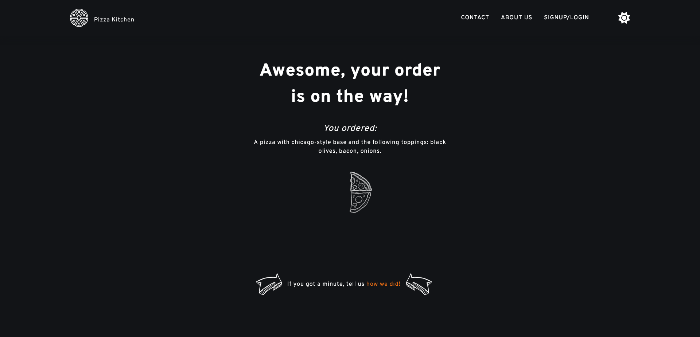
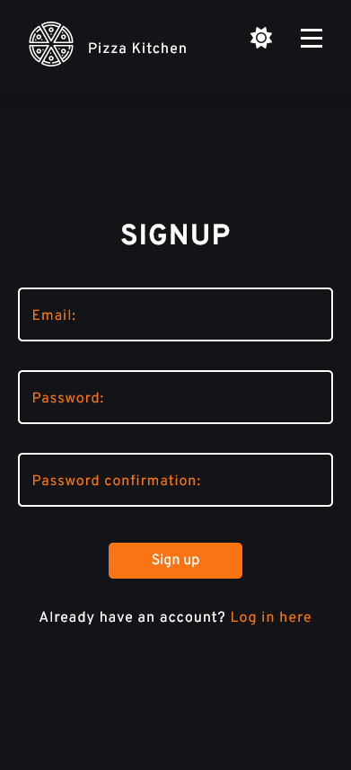

# Frontend Mentor - Interactive rating component solution

This is a solution to the [Interactive rating component challenge on Frontend Mentor](https://www.frontendmentor.io/challenges/interactive-rating-component-koxpeBUmI). Frontend Mentor challenges help you improve your coding skills by building realistic projects.

I actually expanded upon it a bit. You could say this is a completely different project >.<

## Table of contents

- [Overview](#overview)
  - [The challenge](#the-challenge)
  - [Links](#links)
  - [Screenshots](#screenshots)
- [My process](#my-process)
  - [Built with](#built-with)
  - [What I learned](#what-i-learned)
  - [Continued development](#continued-development)
  - [Useful resources](#useful-resources)
- [Author](#author)
- [Acknowledgments](#acknowledgments)

## Overview

### The challenge

Users should be able to:

- View the optimal layout for the app depending on their device's screen size
- See hover states for all interactive elements on the page
- Select and submit a number rating
- See the "Thank you" card state after submitting a rating

The extra bits I added:

- multiple pages, routing
- turned it into an super simple pizza app
- create-your-pizza function
- pizza-loader while user is waiting for the delivery
- contact form
- signup/login function with Firebase
- password reset function with Firebase
- light/dark theme
- turned rating card into a modal

### Links

- Live site: [Pizza Kitchen](https://pizza-kitchen.netlify.app/)

### Screenshots

## My process

The original component was pretty simple. Once it was done I decided to create a simple pizza app out of it (even though I had to change the wording of the actual challenge). I was having a lot of fun with this so I kept adding more and more to it and by the end, the original component became a small modal only.

I don't want to pretend I reinvented the wheel here, I used a bunch of resources (most of the articles, videos and other stuff are listed below) to complete this, as most of the these things were pretty new / completely new to me but I learned heaps.

### Built with

- Semantic HTML5 markup
- CSS custom properties
- Sass
- Flexbox
- CSS Grid
- Mobile-first workflow
- [React](https://reactjs.org/)
- [Framer Motion](https://www.framer.com/motion/)
- [Firebase](https://firebase.google.com/)

### What I learned

- _Framer Motion_: I'm still not comfortable with this but I feel like I'm getting somewhat better. I learned how to animate routes which honestly makes so much difference.

- _React context_: Originally only used it for the authentication, as it was my first time working with context but during the refactoring a ThemeContext and a PizzaContext were also created. I found it makes more sense this way: to avoid [prop drilling](https://kentcdodds.com/blog/prop-drilling) (for example: PizzaContext) or to extract bits and make the code easier to read (ThemeContext). Sometimes context might affect reusability in a bad way, but other times - like in the case of ThemeContext - it can actually improve it.

- _Form handling in React_: Below I listed some articles on the topic of controlled and uncontrolled form inputs. It's a pretty interesting topic, one that everyone seems to be quite opinionated about. From what I understood, in most cases using controlled elements (saving input values in state so data and UI are always in sync) is preferred as they give you more control over what's happening (there was a good example of this in one of the articles: disabling a button until all fields have valid data). Uncontrolled elements seem very much the same as form handling with vanilla Javascript: you let the DOM handle things, the value is saved in a ref which you can pull when the form is submitted. This won't keep the UI in synch with your data (=> no rerenders, which I assume can be an advantage sometimes). Both seem to have some valid use cases and both would've worked just fine for this simple project. I went with state instead of ref purely because this seems to be the more often used solution.

- _Routing_: Truth be told, this got completely reworked when the code was refactored. I feel like the final product is very neat and scalable: all paths are defined in AppRoutes.js then a map is used to create the actual routes out of them. If I wanted to add anything in the future, this would make it very simple. I started using this approach in my other projects too.

- _File structure in React_: Probably this is another topic where people get biased. As my first bigger React project, this was the one where I first had to think about how my file structure should look like, what approach I should take. Started out as a complete mess, now got refactored into something prettier (simpler routing, imports, separate components and pages, moving some of the logic in to context, etc).

- _Firebase authentication_: It was an exciting - and a bit confusing - experience to work with Firebase. My closest experience yet with "backend". Probably it's not considered real backend but the topic of authentication was completely new to me (so was the code I had to write for the implementation). Once you get the hang of it I'm sure Firebase is a great tool.

### Continued development

I've been struggling with formatting my commit messages. Out of all projects, probably this one is the messiest because I was trying to improve on the go (also had [Yazdun](https://github.com/Yazdun) making commits that followed an enitrely different commit convention - probably the one I should've followed too). From one-liners I moved on to having separate title and description for commit messages (when needed). Now that I learned about [Conventional Commits](https://www.conventionalcommits.org/en/v1.0.0/) I try to add commit types as well.

Framer Motion is also something I need to invest more time into.

### Useful resources

- [Net Ninja's Firebase Course](https://www.youtube.com/watch?v=9zdvmgGsww0)
- [Setting up Firebase auth](https://www.youtube.com/watch?v=PKwu15ldZ7k) - it's a bit dated but a good starting point that works fine with some modifications
- [Input animation](https://www.youtube.com/watch?v=v8mRUU3orjI) - A video on how to animate the input label with CSS only
- [useLocalStorage React hook](https://www.npmjs.com/package/use-local-storage) - A hook that simplifies using LocalStorage
- [Easy Dark Mode Setup in React](https://css-tricks.com/easy-dark-mode-and-multiple-color-themes-in-react/) - Using the above mentioned LocalStorage hook
- [React docs on uncontrolled components and useRef](https://reactjs.org/docs/uncontrolled-components.html)
- [Article on controlled vs uncontrolled components](https://goshacmd.com/controlled-vs-uncontrolled-inputs-react/)
- [Page transition effects with Framer Motion](https://www.youtube.com/watch?v=FdrEjwymzdY)
- [Click outside to close mobile menu in React](https://www.youtube.com/watch?v=eWO1b6EoCnQ)

## Author

- Frontend Mentor - [@FluffyKas](https://www.frontendmentor.io/profile/FluffyKas)
- Twitter - [@fluffykas](https://www.twitter.com/FluffyKas)

## Acknowledgments

Special thanks to [Yazdun](https://github.com/Yazdun) for refactoring the file structure and helping me with React best practices.

The home page background image and pizza slice images were made by Luci Maruzs, she can be found on [Instagram](https://www.instagram.com/) (link should be updated soon)

_Obligatory attributions_

The logo and the arrow icon in the finished order page is from [Flaticon (made by rang)](https://www.flaticon.com/free-icons/arrow)
